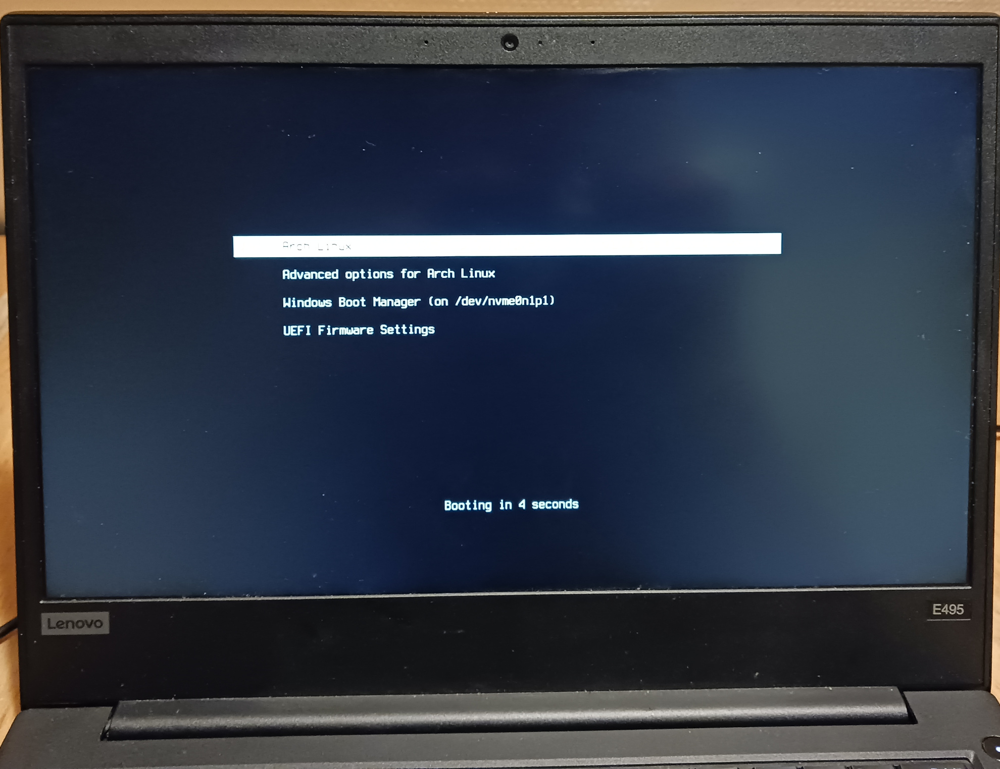

# simple-hidpi-grub-theme
a system-boot-inspired grub theme made for a hidpi 1980x1080 screen.


_Could not get grub to preview theme. Hopefully this will suffice as a preview._

## Install instructions
Clone this repository.
```
git clone --depth=1 --branch=main https://github.com/abxh/simple-hidpi-grub-theme
```

Copy the theme to `/boot/grub/themes`. The steps after this should be done as the superuser or through tools like `sudo`.
```
mkdir -p /boot/grub/themes
cp -r simple-hidpi-grub-theme/src /boot/grub/themes/simple-hidpi-grub-theme
```

Set the theme by changing the `GRUB_THEME` variable in `/etc/default/grub`.
```
# /etc/default/grub
GRUB_THEME="/boot/grub/themes/simple-hidpi-grub-theme/theme.txt"
```

Update the grub config.
```
grub-mkconfig -o /boot/grub/grub.cfg
```

## Optional
Replace the `font.pf2` to the desired font for one's dpi.
```
# for terminus-font in arch
cp /usr/share/grub/ter-u28b.pf2 /boot/grub/themes/simple-hidpi-grub-theme/font.pf2
```
